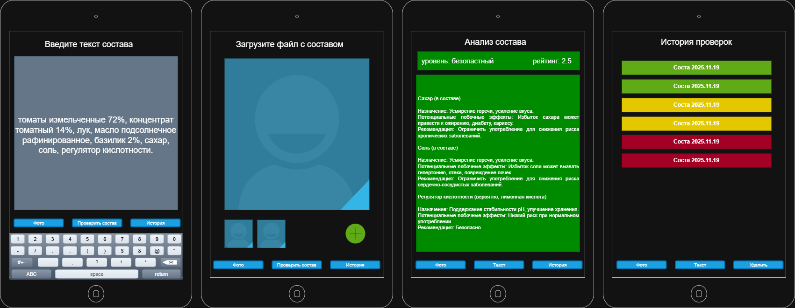

# 202508-ok-marketplace

Учебный проект курса
[Kotlin Backend Developer](https://otus.ru/lessons/kotlin/).
Поток курса 2025-08.

Ingredient Scan -- это система анализа ингредиентов продукта по составу.
И отвечает на вопрос насколько безопасен продукт и есть ли в нем нежелательные к употреблению компоненты.

## Визуальная схема фронтенда

## Документация

1. Маркетинг и аналитика
    1. [Целевая аудитория](./docs/01-biz/01-target-audience.md)
    2. [Заинтересанты](./docs/01-biz/02-stakeholders.md)
    3. [Пользовательские истории](./docs/01-biz/03-bizreq.md)
2. Аналитика:
    1. [Функциональные требования](./docs/02-analysis/01-functional-requiremens.md)
    2. [Нефункциональные требования](./docs/02-analysis/02-nonfunctional-requirements.md)
3. Архитектура
    1. [ADR](docs/03-architecture/01-adrs.md)
    2. [Описание API](docs/03-architecture/02-api.md)
    3. [Архитектурные схемы](docs/03-architecture/03-arch.md)

